# 📈 AI Stock Screener - Comprehensive Documentation

## Table of Contents
1. [Project Overview](#project-overview)
2. [Architecture](#architecture)
3. [Technology Stack](#technology-stack)
4. [Project Structure](#project-structure)
5. [Setup Instructions](#setup-instructions)
6. [Database Schema](#database-schema)
7. [Backend API Reference](#backend-api-reference)
8. [Frontend Interface](#frontend-interface)
9. [Code Modules](#code-modules)
10. [Query Processing Flow](#query-processing-flow)
11. [Usage Examples](#usage-examples)
12. [Future Enhancements](#future-enhancements)

---

## Project Overview

The **AI Stock Screener** is an intelligent stock screening application that allows users to query stock market data using natural language. The system uses a Large Language Model (LLM) to convert English queries into a structured Domain-Specific Language (DSL), which is then validated, compiled to SQL, and executed against a MySQL database.

### Key Features

- 🤖 **Natural Language Processing**: Convert plain English queries to structured database queries
- 🔐 **Token-based Authentication**: Secure API with user authentication
- ✅ **Input Validation**: Comprehensive DSL and query validation
- 📊 **Real-time Screening**: Execute complex stock screening queries instantly
- 🎨 **User-friendly Interface**: Streamlit-based frontend for easy interaction
- 🗄️ **Relational Database**: MySQL backend with comprehensive stock data

### Use Cases

- Screen stocks based on financial metrics (PE ratio, debt, cash flow)
- Filter by sector, exchange, or company fundamentals
- Find stocks with specific quarterly performance characteristics
- Analyze stocks based on analyst target prices
- Combine multiple criteria for advanced screening

---

## Architecture

The system follows a **layered architecture** with clear separation of concerns:


### Architecture Layers

1. **Presentation Layer** ([streamlit_app.py](file:///c:/Sohan/Springboard%20internship/stock-ai-frontend/streamlit_app.py))
   - User interface built with Streamlit
   - Handles login and authentication token management
   - Displays query results in tabular format

2. **API Layer** ([main.py](file:///c:/Sohan/Springboard%20internship/stock-ai-backend/main.py))
   - FastAPI-based REST API
   - Token-based authentication
   - Request/response handling
   - Error management

3. **Business Logic Layer**
   - **Screener Service** ([screener_service.py](file:///c:/Sohan/Springboard%20internship/stock-ai-backend/screener_service.py)): Orchestrates the screening workflow
   - **LLM Integration** ([llm_integration.py](file:///c:/Sohan/Springboard%20internship/stock-ai-backend/llm_integration.py)): Converts English to DSL
   - **Validator** ([validator.py](file:///c:/Sohan/Springboard%20internship/stock-ai-backend/validator.py)): Validates DSL structure and fields
   - **Rule Compiler** ([rule_compiler.py](file:///c:/Sohan/Springboard%20internship/stock-ai-backend/rule_compiler.py)): Compiles DSL to SQL

4. **Data Layer**
   - **Field Registry** ([field_registry.py](file:///c:/Sohan/Springboard%20internship/stock-ai-backend/field_registry.py)): Defines available database fields
   - **Database Connection** ([db.py](file:///c:/Sohan/Springboard%20internship/stock-ai-backend/db.py)): MySQL connection management

5. **External Services**
   - **Ollama/Mistral LLM**: Provides natural language understanding

---

## Technology Stack

### Backend
- **Framework**: FastAPI (high-performance Python web framework)
- **LLM Integration**: Ollama with Mistral model
- **Database**: MySQL 8.0+
- **Database Driver**: mysql-connector-python
- **Authentication**: Token-based (UUID)
- **API Protocol**: REST with JSON

### Frontend
- **Framework**: Streamlit
- **HTTP Client**: requests library
- **Session Management**: Streamlit session state

### Development Tools
- **Language**: Python 3.10+
- **Virtual Environment**: venv
- **Package Management**: pip

---

## Project Structure

```
Springboard internship/
├── README.md                      # Basic project description
├── dsl_output.json                # Sample DSL output
│
├── stock-ai-backend/              # Backend application
│   ├── main.py                    # FastAPI application entry point
│   ├── screener_service.py        # Core screening logic orchestration
│   ├── llm_integration.py         # Ollama/Mistral LLM integration
│   ├── validator.py               # DSL validation logic
│   ├── rule_compiler.py           # DSL to SQL compiler
│   ├── field_registry.py          # Database field definitions
│   ├── db.py                      # MySQL connection utilities
│   └── venv/                      # Python virtual environment
│
└── stock-ai-frontend/             # Frontend application
    └── streamlit_app.py           # Streamlit UI application
```

---

## Setup Instructions

### Prerequisites

1. **Python 3.10+** installed on your system
2. **MySQL Server** (version 8.0 or higher)
3. **Ollama** installed with Mistral model
4. **pip** package manager

### Backend Setup

1. **Navigate to the backend directory**:
   ```bash
   cd "c:\Sohan\Springboard internship\stock-ai-backend"
   ```

2. **Activate the virtual environment**:
   ```bash
   # Windows
   .\venv\Scripts\activate
   
   # Linux/Mac
   source venv/bin/activate
   ```

3. **Install dependencies**:
   ```bash
   pip install fastapi uvicorn mysql-connector-python pydantic requests
   ```

4. **Configure database connection**:
   - Edit [db.py](file:///c:/Sohan/Springboard%20internship/stock-ai-backend/db.py)
   - Update MySQL credentials:
     ```python
     host="localhost"
     user="root"
     password="your_password"  # Change this
     database="stock_screener"
     ```

5. **Create the MySQL database** (see [Database Schema](#database-schema))

6. **Start Ollama** (in a separate terminal):
   ```bash
   ollama serve
   ```

7. **Ensure Mistral model is installed**:
   ```bash
   ollama pull mistral
   ```

8. **Run the FastAPI backend**:
   ```bash
   uvicorn main:app --reload --port 8000
   ```

   The API will be available at: `http://localhost:8000`

### Frontend Setup

1. **Navigate to the frontend directory**:
   ```bash
   cd "c:\Sohan\Springboard internship\stock-ai-frontend"
   ```

2. **Install Streamlit** (if not already installed):
   ```bash
   pip install streamlit requests
   ```

3. **Run the Streamlit app**:
   ```bash
   streamlit run streamlit_app.py
   ```

   The UI will open automatically at: `http://localhost:8501`

### Default Login Credentials

```
Email: admin@test.com
Password: admin123
```

> ⚠️ **Security Note**: These are hardcoded credentials for demonstration. In production, implement proper user management with hashed passwords and a user database.

---

## Database Schema

The system uses a relational MySQL database with four main tables:

### 1. `stocks_master` Table

Master table containing basic stock information.

```sql
CREATE TABLE stocks_master (
    id INT PRIMARY KEY AUTO_INCREMENT,
    symbol VARCHAR(20) UNIQUE NOT NULL,
    company_name VARCHAR(255) NOT NULL,
    sector VARCHAR(100),
    exchange VARCHAR(50),
    created_at TIMESTAMP DEFAULT CURRENT_TIMESTAMP
);
```

**Fields**:
- `id`: Primary key
- `symbol`: Stock ticker symbol (e.g., AAPL, TSLA)
- `company_name`: Full company name
- `sector`: Industry sector (e.g., IT, Healthcare, Finance)
- `exchange`: Stock exchange (e.g., NYSE, NASDAQ)

### 2. `fundamentals` Table

Contains fundamental analysis metrics.

```sql
CREATE TABLE fundamentals (
    id INT PRIMARY KEY AUTO_INCREMENT,
    stock_id INT NOT NULL,
    pe_ratio DECIMAL(10, 2),
    peg_ratio DECIMAL(10, 2),
    debt DECIMAL(15, 2),
    free_cash_flow DECIMAL(15, 2),
    updated_at TIMESTAMP DEFAULT CURRENT_TIMESTAMP ON UPDATE CURRENT_TIMESTAMP,
    FOREIGN KEY (stock_id) REFERENCES stocks_master(id)
);
```

**Fields**:
- `pe_ratio`: Price-to-Earnings ratio
- `peg_ratio`: Price/Earnings to Growth ratio
- `debt`: Total debt in dollars
- `free_cash_flow`: Free cash flow in dollars

### 3. `quarterly_financials` Table

Quarterly financial performance data.

```sql
CREATE TABLE quarterly_financials (
    id INT PRIMARY KEY AUTO_INCREMENT,
    stock_id INT NOT NULL,
    quarter VARCHAR(10),
    year INT,
    revenue DECIMAL(15, 2),
    ebitda DECIMAL(15, 2),
    net_profit DECIMAL(15, 2),
    FOREIGN KEY (stock_id) REFERENCES stocks_master(id)
);
```

**Fields**:
- `quarter`: Quarter identifier (Q1, Q2, Q3, Q4)
- `year`: Year
- `revenue`: Quarterly revenue
- `ebitda`: Earnings Before Interest, Taxes, Depreciation, and Amortization
- `net_profit`: Net profit for the quarter

### 4. `analyst_targets` Table

Analyst price targets and current market prices.

```sql
CREATE TABLE analyst_targets (
    id INT PRIMARY KEY AUTO_INCREMENT,
    stock_id INT NOT NULL,
    target_price_low DECIMAL(10, 2),
    target_price_high DECIMAL(10, 2),
    current_market_price DECIMAL(10, 2),
    updated_at TIMESTAMP DEFAULT CURRENT_TIMESTAMP ON UPDATE CURRENT_TIMESTAMP,
    FOREIGN KEY (stock_id) REFERENCES stocks_master(id)
);
```

**Fields**:
- `target_price_low`: Analyst consensus low target
- `target_price_high`: Analyst consensus high target
- `current_market_price`: Current trading price

### Entity Relationship Diagram


---

## Backend API Reference

The backend exposes a RESTful API built with FastAPI.

### Base URL
```
http://localhost:8000
```

### API Documentation
FastAPI provides auto-generated interactive documentation:
- **Swagger UI**: `http://localhost:8000/docs`
- **ReDoc**: `http://localhost:8000/redoc`

---

### POST `/login`

Authenticate a user and receive an access token.

**Request Body**:
```json
{
  "email": "admin@test.com",
  "password": "admin123"
}
```

**Response** (200 OK):
```json
{
  "access_token": "550e8400-e29b-41d4-a716-446655440000"
}
```

**Error Response** (401 Unauthorized):
```json
{
  "detail": "Invalid credentials"
}
```

**Example**:
```bash
curl -X POST http://localhost:8000/login \
  -H "Content-Type: application/json" \
  -d '{"email":"admin@test.com","password":"admin123"}'
```

---

### POST `/screen`

Execute a stock screening query using natural language.

**Headers**:
```
Authorization: <access_token>
```

**Request Body**:
```json
{
  "text": "Stocks with PE ratio less than 25"
}
```

**Response** (200 OK):
```json
{
  "status": "success",
  "count": 15,
  "rows": [
    {
      "symbol": "AAPL",
      "company_name": "Apple Inc."
    },
    {
      "symbol": "MSFT",
      "company_name": "Microsoft Corporation"
    }
  ]
}
```

**Error Response** (400 Bad Request):
```json
{
  "detail": "Unsupported Query"
}
```

**Error Response** (401 Unauthorized):
```json
{
  "detail": "Unauthorized"
}
```

**Example**:
```bash
curl -X POST http://localhost:8000/screen \
  -H "Content-Type: application/json" \
  -H "Authorization: 550e8400-e29b-41d4-a716-446655440000" \
  -d '{"text":"Technology stocks with PE less than 25"}'
```

---

## Frontend Interface

The Streamlit frontend provides a simple, intuitive interface for stock screening.

### Login Page


- Email input field
- Password input field (masked)
- Login button
- Error/success messages

### Screener Page


**Features**:
- Query input text box
- "Run Screener" button
- Results table display
- Result count indicator
- Logout button

**Sample Queries**:
- "Stocks with PE ratio less than 25"
- "Technology stocks with positive net profit"
- "Stocks with debt less than 1000000"
- "Companies with free cash flow greater than 500000"

---

## Code Modules

### 1. [main.py](file:///c:/Sohan/Springboard%20internship/stock-ai-backend/main.py)

**Purpose**: FastAPI application entry point and API endpoint definitions.

**Key Components**:
- `FastAPI` app initialization
- `LoginRequest` model: Pydantic model for login data
- `ScreenRequest` model: Pydantic model for screening queries
- `login()`: Handles user authentication
- `verify_token()`: Dependency for token validation
- `screen()`: Main screening endpoint

**Authentication Flow**:
```python
TOKENS = {}  # In-memory token store

# On login success
token = str(uuid.uuid4())
TOKENS[token] = user_email
```

---

### 2. [screener_service.py](file:///c:/Sohan/Springboard%20internship/stock-ai-backend/screener_service.py)

**Purpose**: Orchestrates the complete screening workflow.

**Function**: `run_query(user_query)`

**Workflow**:
```python
def run_query(user_query):
    # Step 1: Convert English to DSL
    dsl = english_to_dsl(user_query)
    
    # Step 2: Validate DSL
    valid, error = validate_dsl(dsl)
    
    # Step 3: Compile DSL to SQL
    sql = compile_sql(dsl)
    
    # Step 4: Execute SQL
    cursor.execute(sql)
    rows = cursor.fetchall()
    
    return {"status": "success", "count": len(rows), "rows": rows}
```

**Error Handling**:
- LLM errors → Returns error message
- Validation errors → Returns validation message
- Database errors → Returns database error

---

### 3. [llm_integration.py](file:///c:/Sohan/Springboard%20internship/stock-ai-backend/llm_integration.py)

**Purpose**: Integrates with Ollama/Mistral LLM for natural language processing.

**Function**: `english_to_dsl(query: str)`

**Configuration**:
```python
OLLAMA_URL = "http://localhost:11434/v1/chat/completions"
MODEL = "mistral"
```

**System Prompt**:
The system uses a carefully crafted prompt to instruct the LLM to:
- Generate only valid JSON
- Use exact field names from the field registry
- Convert natural language operators to SQL operators
- Handle invalid queries gracefully

**Example Request to Ollama**:
```python
payload = {
    "model": "mistral",
    "messages": [
        {"role": "system", "content": SYSTEM_PROMPT},
        {"role": "user", "content": "Stocks with PE less than 25"}
    ],
    "temperature": 0
}
```

**Example Output**:
```json
{
  "conditions": [
    {
      "field": "pe_ratio",
      "operator": "<",
      "value": 25
    }
  ]
}
```

---

### 4. [validator.py](file:///c:/Sohan/Springboard%20internship/stock-ai-backend/validator.py)

**Purpose**: Validates DSL structure and ensures data integrity.

**Function**: `validate_dsl(dsl)`

**Validation Rules**:

1. **Structure Check**:
   ```python
   if "conditions" not in dsl or not isinstance(dsl["conditions"], list):
       return False, "Invalid DSL structure"
   ```

2. **Field Validation**:
   ```python
   if field not in FIELD_REGISTRY:
       return False, "Unsupported Query"
   ```

3. **Operator Validation**:
   ```python
   ALLOWED_OPERATORS = {"<", ">", "=", "<=", ">="}
   if operator not in ALLOWED_OPERATORS:
       return False, f"Unsupported operator: {operator}"
   ```

4. **Value Validation**:
   ```python
   if value is None:
       return False, f"Missing value for field: {field}"
   ```

---

### 5. [rule_compiler.py](file:///c:/Sohan/Springboard%20internship/stock-ai-backend/rule_compiler.py)

**Purpose**: Compiles validated DSL into executable SQL queries.

**Function**: `compile_sql(dsl)`

**Compilation Process**:

1. **Join Management**:
   ```python
   joins = set()
   if table == "fundamentals":
       joins.add("JOIN fundamentals f ON s.id = f.stock_id")
   ```

2. **WHERE Clause Generation**:
   ```python
   if meta["type"] == "string":
       where.append(f"{alias}.{column} {op} '{val}'")
   else:
       where.append(f"{alias}.{column} {op} {val}")
   ```

3. **SQL Assembly**:
   ```python
   sql = f"""
   SELECT DISTINCT s.symbol, s.company_name
   FROM stocks_master s
   {' '.join(joins)}
   WHERE {' AND '.join(where)}
   """
   ```

**Example**:

Input DSL:
```json
{
  "conditions": [
    {"field": "pe_ratio", "operator": "<", "value": 25},
    {"field": "sector", "operator": "=", "value": "IT"}
  ]
}
```

Output SQL:
```sql
SELECT DISTINCT s.symbol, s.company_name
FROM stocks_master s
JOIN fundamentals f ON s.id = f.stock_id
WHERE f.pe_ratio < 25 AND s.sector = 'IT'
```

---

### 6. [field_registry.py](file:///c:/Sohan/Springboard%20internship/stock-ai-backend/field_registry.py)

**Purpose**: Central registry of all queryable database fields.

**Structure**:
```python
FIELD_REGISTRY = {
    "field_name": {
        "table": "table_name",
        "column": "column_name",
        "type": "string" | "number",
        "alias": "table_alias"
    }
}
```

**Supported Fields**:

| Field Name | Table | Type | Description |
|------------|-------|------|-------------|
| `symbol` | stocks_master | string | Stock ticker |
| `company_name` | stocks_master | string | Company name |
| `sector` | stocks_master | string | Industry sector |
| `exchange` | stocks_master | string | Stock exchange |
| `pe_ratio` | fundamentals | number | Price-to-Earnings ratio |
| `peg_ratio` | fundamentals | number | PEG ratio |
| `debt` | fundamentals | number | Total debt |
| `free_cash_flow` | fundamentals | number | Free cash flow |
| `revenue` | quarterly_financials | number | Quarterly revenue |
| `ebitda` | quarterly_financials | number | EBITDA |
| `net_profit` | quarterly_financials | number | Net profit |
| `target_price_low` | analyst_targets | number | Low target price |
| `target_price_high` | analyst_targets | number | High target price |
| `current_market_price` | analyst_targets | number | Current price |

---

### 7. [db.py](file:///c:/Sohan/Springboard%20internship/stock-ai-backend/db.py)

**Purpose**: Database connection management.

**Function**: `get_db()`

```python
def get_db():
    return mysql.connector.connect(
        host="localhost",
        user="root",
        password="Sohan@2004",
        database="stock_screener"
    )
```

> ⚠️ **Security Note**: Credentials should be moved to environment variables or a secure configuration file.

---

### 8. [streamlit_app.py](file:///c:/Sohan/Springboard%20internship/stock-ai-frontend/streamlit_app.py)

**Purpose**: User interface implementation.

**Key Features**:

1. **Session Management**:
   ```python
   if "token" not in st.session_state:
       st.session_state.token = None
   ```

2. **Login Flow**:
   ```python
   res = requests.post(f"{API}/login", json={"email": email, "password": password})
   if res.status_code == 200:
       st.session_state.token = res.json()["access_token"]
       st.rerun()
   ```

3. **Screening Request**:
   ```python
   res = requests.post(
       f"{API}/screen",
       json={"text": query},
       headers={"Authorization": st.session_state.token}
   )
   ```

4. **Results Display**:
   ```python
   if data["count"] == 0:
       st.warning("No matching results found")
   else:
       st.success(f"Total results: {data['count']}")
       st.table(data["rows"])
   ```

---

## Query Processing Flow

Here's a detailed breakdown of how a query is processed from user input to results:

```mermaid
sequenceDiagram
    participant User
    participant Frontend
    participant API
    participant Service
    participant LLM
    participant Validator
    participant Compiler
    participant Database

    User->>Frontend: Enter query: "Stocks with PE < 25"
    Frontend->>API: POST /screen with token
    API->>API: Verify token
    API->>Service: run_query(query)
    Service->>LLM: english_to_dsl(query)
    LLM->>LLM: Parse natural language
    LLM-->>Service: DSL JSON
    Service->>Validator: validate_dsl(dsl)
    Validator->>Validator: Check fields, operators, values
    Validator-->>Service: Valid ✓
    Service->>Compiler: compile_sql(dsl)
    Compiler->>Compiler: Generate SQL with JOINs
    Compiler-->>Service: SQL query
    Service->>Database: Execute SQL
    Database-->>Service: Result rows
    Service-->>API: {status, count, rows}
    API-->>Frontend: JSON response
    Frontend->>User: Display table
```



### Step-by-Step Breakdown

1. **User Input** (Frontend)
   - User types natural language query
   - Frontend sends POST request to `/screen` with authorization token

2. **Authentication** (API Layer)
   - `verify_token()` checks if token exists in `TOKENS` dictionary
   - If invalid, returns 401 Unauthorized

3. **Service Orchestration** (Service Layer)
   - `run_query()` coordinates the entire workflow
   - Manages error handling at each step

4. **Natural Language Processing** (LLM Integration)
   - Query sent to Ollama/Mistral via OpenAI-compatible API
   - System prompt guides LLM to generate structured JSON DSL
   - Temperature set to 0 for deterministic output

5. **DSL Validation** (Validator)
   - Checks JSON structure
   - Validates field names against `FIELD_REGISTRY`
   - Ensures operators are in `ALLOWED_OPERATORS`
   - Verifies all required values are present

6. **SQL Compilation** (Compiler)
   - Iterates through DSL conditions
   - Builds JOIN clauses based on referenced tables
   - Constructs WHERE clause with proper SQL syntax
   - Handles string vs. number value formatting

7. **Database Execution** (Data Layer)
   - Establishes MySQL connection
   - Executes compiled SQL query
   - Fetches results as dictionary
   - Closes connection

8. **Response Formatting** (API Layer)
   - Wraps results in standard response format
   - Returns JSON with status, count, and rows

9. **Display** (Frontend)
   - Parses JSON response
   - Displays results in Streamlit table
   - Shows error messages if applicable

---

## Usage Examples

### Example 1: Basic PE Ratio Filter

**Query**:
```
Stocks with PE ratio less than 25
```

**Generated DSL**:
```json
{
  "conditions": [
    {
      "field": "pe_ratio",
      "operator": "<",
      "value": 25
    }
  ]
}
```

**Generated SQL**:
```sql
SELECT DISTINCT s.symbol, s.company_name
FROM stocks_master s
JOIN fundamentals f ON s.id = f.stock_id
WHERE f.pe_ratio < 25
```

---

### Example 2: Sector-based Filter

**Query**:
```
Technology stocks
```

**Generated DSL**:
```json
{
  "conditions": [
    {
      "field": "sector",
      "operator": "=",
      "value": "IT"
    }
  ]
}
```

**Generated SQL**:
```sql
SELECT DISTINCT s.symbol, s.company_name
FROM stocks_master s
WHERE s.sector = 'IT'
```

---

### Example 3: Multiple Conditions

**Query**:
```
Technology stocks with PE ratio less than 25 and positive net profit
```

**Generated DSL**:
```json
{
  "conditions": [
    {
      "field": "sector",
      "operator": "=",
      "value": "IT"
    },
    {
      "field": "pe_ratio",
      "operator": "<",
      "value": 25
    },
    {
      "field": "net_profit",
      "operator": ">",
      "value": 0
    }
  ]
}
```

**Generated SQL**:
```sql
SELECT DISTINCT s.symbol, s.company_name
FROM stocks_master s
JOIN fundamentals f ON s.id = f.stock_id
JOIN quarterly_financials q ON s.id = q.stock_id
WHERE s.sector = 'IT' AND f.pe_ratio < 25 AND q.net_profit > 0
```

---

### Example 4: Financial Metrics

**Query**:
```
Stocks with low debt and high free cash flow
```

**Generated DSL**:
```json
{
  "conditions": [
    {
      "field": "debt",
      "operator": "<",
      "value": 1000000
    },
    {
      "field": "free_cash_flow",
      "operator": ">",
      "value": 500000
    }
  ]
}
```

**Generated SQL**:
```sql
SELECT DISTINCT s.symbol, s.company_name
FROM stocks_master s
JOIN fundamentals f ON s.id = f.stock_id
WHERE f.debt < 1000000 AND f.free_cash_flow > 500000
```

---

### Example 5: Analyst Targets

**Query**:
```
Stocks trading below analyst low target
```

**Generated DSL**:
```json
{
  "conditions": [
    {
      "field": "current_market_price",
      "operator": "<",
      "value": "target_price_low"
    }
  ]
}
```

> ⚠️ **Note**: Currently, field-to-field comparisons are not supported. This would require enhancing the DSL schema.

---

## Future Enhancements

### 1. Advanced Query Features

- [ ] **Field-to-field comparisons**: Compare two database columns
  - Example: "Stocks where current price < target price low"
  
- [ ] **Temporal queries**: Historical data analysis
  - Example: "Stocks with revenue growth > 10% in last 4 quarters"
  
- [ ] **Aggregations**: MIN, MAX, AVG, SUM operations
  - Example: "Stocks with average quarterly revenue > 1M"

- [ ] **Sorting and Limiting**: ORDER BY and LIMIT clauses
  - Example: "Top 10 stocks by PE ratio"

### 2. Security Enhancements

- [ ] **Database credentials**: Move to environment variables
- [ ] **User database**: Replace hardcoded credentials with proper user management
- [ ] **Password hashing**: Use bcrypt or similar for password storage
- [ ] **JWT tokens**: Replace UUID tokens with signed JWTs
- [ ] **Rate limiting**: Prevent API abuse
- [ ] **Input sanitization**: Additional SQL injection prevention

### 3. Data Enhancements

- [ ] **Real-time data**: Integration with live stock APIs
- [ ] **Historical data**: Time-series price and volume data
- [ ] **More metrics**: Volatility, beta, dividend yield, etc.
- [ ] **News sentiment**: Incorporate sentiment analysis
- [ ] **Industry comparison**: Peer benchmarking

### 4. User Experience

- [ ] **Query suggestions**: Auto-complete for common queries
- [ ] **Result visualization**: Charts and graphs
- [ ] **Export functionality**: CSV, Excel, PDF export
- [ ] **Saved queries**: Bookmark favorite screens
- [ ] **Alerts**: Email/SMS notifications for matching stocks
- [ ] **Query history**: Track previously run queries

### 5. Performance Optimizations

- [ ] **Caching**: Redis cache for frequent queries
- [ ] **Database indexing**: Optimize query performance
- [ ] **Connection pooling**: Manage database connections efficiently
- [ ] **Async operations**: Non-blocking I/O for better concurrency
- [ ] **Query optimization**: Advanced SQL query planning

### 6. LLM Improvements

- [ ] **Model fine-tuning**: Train on financial domain data
- [ ] **Fallback models**: Multiple LLM options (GPT, Claude, etc.)
- [ ] **Prompt versioning**: A/B test different prompts
- [ ] **Confidence scoring**: Return LLM confidence with results
- [ ] **Query clarification**: Ask for user clarification on ambiguous queries

### 7. Testing & Quality

- [ ] **Unit tests**: Comprehensive test coverage
- [ ] **Integration tests**: End-to-end testing
- [ ] **Load testing**: Performance under high load
- [ ] **Monitoring**: Application health and metrics
- [ ] **Logging**: Structured logging for debugging

### 8. Deployment

- [ ] **Containerization**: Docker setup for easy deployment
- [ ] **Cloud deployment**: AWS/GCP/Azure deployment guide
- [ ] **CI/CD pipeline**: Automated testing and deployment
- [ ] **Database migrations**: Version control for schema changes
- [ ] **Environment management**: Dev, staging, production environments

---

## Troubleshooting

### Common Issues

#### Issue: Ollama Connection Error

**Symptom**: `LLM returned non-JSON output` or connection timeout

**Solution**:
```bash
# Check if Ollama is running
ollama list

# Start Ollama server
ollama serve

# Verify Mistral model is installed
ollama pull mistral
```

#### Issue: MySQL Connection Failed

**Symptom**: `Connection refused` or authentication error

**Solution**:
1. Verify MySQL is running
2. Check credentials in [db.py](file:///c:/Sohan/Springboard%20internship/stock-ai-backend/db.py)
3. Ensure database `stock_screener` exists
4. Grant proper permissions to the MySQL user

#### Issue: "Unsupported Query" Error

**Symptom**: Validation fails for valid-looking queries

**Solution**:
- Check if the field name is in `FIELD_REGISTRY`
- Ensure the LLM is using exact field names (e.g., `pe_ratio` not `pe`)
- Review the LLM output in console logs

#### Issue: Empty Results

**Symptom**: Query succeeds but returns 0 results

**Solution**:
- Verify database has data
- Check if query conditions are too restrictive
- Review generated SQL in console output
- Run SQL manually in MySQL to debug

---

## Performance Considerations

### Query Optimization

- **Indexes**: Create indexes on frequently queried columns:
  ```sql
  CREATE INDEX idx_pe_ratio ON fundamentals(pe_ratio);
  CREATE INDEX idx_sector ON stocks_master(sector);
  ```

- **DISTINCT**: The `DISTINCT` keyword may slow down large result sets
- **JOINs**: Multiple JOINs can impact performance; consider denormalization for critical queries

### LLM Response Time

- **Cold start**: First LLM request may be slower
- **Model size**: Larger models provide better accuracy but slower response
- **Temperature**: Set to 0 for consistent, faster results

---

## Contributing

If you'd like to contribute to this project:

1. Fork the repository
2. Create a feature branch
3. Make your changes with proper documentation
4. Add tests for new functionality
5. Submit a pull request

---

## License

This project is part of a Springboard internship and is for educational purposes.

---

## Contact & Support

For questions or support:
- Create an issue in the repository
- Contact the development team

---

**Last Updated**: February 2, 2026

**Version**: 1.0.0

**Status**: Active Development
